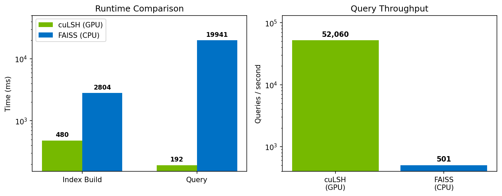

# cuLSH

cuLSH is a GPU-accelerated locality-sensitive hashing library.  
It provides a scikit-learn-like `fit`/`query` API for fully managed index building and querying.

## Supported Algorithms

| Algorithm | Class | Distance Metric | Data Type |
|-----------|-------|-----------------|-----------|
| Random Projection LSH | `RPLSH` | Cosine | Dense |
| MinHash LSH | `MinHashLSH` | Jaccard | Sparse |
| p-Stable LSH | `PStableLSH` | Euclidean | Dense |

## Installation

**Prerequisites:** [CUDA Toolkit](https://developer.nvidia.com/cuda-downloads) (11.8+), [CMake](https://cmake.org/download/) (3.24+), C++17 compiler.

```bash
git clone https://github.com/rishic3/cuLSH.git
cd cuLSH/python
pip install .
```

**For development:**

```bash
pip install -e .
pip install -r requirements_dev.txt

# Rebuild .so after C++ changes
make clean && make release
```

## Usage

### Numpy Example

```python
import numpy as np
from culsh import PStableLSH

# Numpy inputs
X = np.random.randn(10000, 128).astype(np.float32)
Q = np.random.randn(100, 128).astype(np.float32)

# Fit (returns PStableLSHModel)
model = PStableLSH(n_hash_tables=16, n_hashes=8, seed=42).fit(X)

# Query (returns candidate neighbors)
candidates = model.query(Q)

# Access results
indices = candidates.get_indices()   # Candidate neighbor indices
offsets = candidates.get_offsets()   # Start offset for each query in indices
counts = candidates.get_counts()     # Number of candidates per query
```

### Cupy Example

```python
import cupy as cp
from culsh import PStableLSH

# Cupy inputs
X = cp.random.randn(10000, 128, dtype=cp.float32)
Q = cp.random.randn(100, 128, dtype=cp.float32)

model = PStableLSH(n_hash_tables=16, n_hashes=8).fit(X)
candidates = model.query(Q)

# Access results as cupy arrays
indices = candidates.get_indices(as_cupy=True)
offsets = candidates.get_offsets(as_cupy=True)
```

### Sparse Data

```python
import scipy.sparse  
# import cupyx.scipy.sparse
from culsh import MinHashLSH

X = scipy.sparse.random(10000, 5000, density=0.01, format='csr')
Q = scipy.sparse.random(100, 5000, density=0.01, format='csr')
# Or use cupy:
# X = cupyx.scipy.sparse.random(10000, 5000, density=0.01, format='csr')
# Q = cupyx.scipy.sparse.random(100, 5000, density=0.01, format='csr')

model = MinHashLSH(n_hash_tables=32, n_hashes=4).fit(X)
candidates = model.query(Q)
```

### Simultaneous Fit and Query

Query the same data used for fitting:

```python
candidates = PStableLSH(n_hash_tables=16, n_hashes=8).fit_query(X)
```

### Batched Queries

For large query sets, use `batch_size` to reduce peak GPU memory:

```python
candidates = model.query(Q, batch_size=1000)
```

### Save and Load

```python
# Save fitted model
model.save("model.npz")

# Load model
from culsh import PStableLSHModel
model = PStableLSHModel.load("model.npz")
```

## Benchmarks

Benchmark results (log-scale):



**Dataset:** SIFT1M 1M training vectors, 10k query vectors, 128 dimensions.

**Algorithm:** RPLSH (GPU), FAISS IndexLSH (CPU). 32 hash tables × 16 hashes.

**Hardware:** NVIDIA RTX A6000 (GPU), Intel Core i9-14900K w/AVX2 (CPU).

> **Note:** cuLSH uses bucket-based retrieval (returns all bucket matches), while FAISS IndexLSH uses hash-then-scan (computes Hamming distance to all vectors and returns top-k). The top-k value for FAISS was set to match mean candidates returned by cuLSH for a comparison at equal output sizes. Comparison of recall, however, doesn't exactly sense here given the algorithmic differences.
